💰 Expense Book

Smart personal finance tracking made simple — a full-stack expense management platform to help users efficiently manage income, expenses, and financial insights.

📌 Overview

Expense Book is a modern full-stack web application designed to help users track their income and expenses in a structured and visual way.

The platform focuses on simplicity, clarity, and real-time financial insights, allowing users to manage their daily transactions and analyze monthly spending patterns effortlessly.

✨ Features

🧾 Income & Expense Tracking
➕ Add, ✏️ Edit, ❌ Delete transactions

📊 Dashboard Overview
Real-time summary of income, expenses, and balance

📈 Monthly Analytics
Graphical representation of spending trends

🌗 Dark / Light Mode
Seamless theme switching for better user experience

🔐 User Authentication
Secure login & registration system

⚙️ Settings Panel
User preferences and customization options

📱 Fully Responsive UI

🛠️ Tech Stack
🎨 Frontend

Angular
TypeScript
HTML5, CSS3
Bootstrap

⚙️ Backend

.NET Core Web API
Entity Framework Core

🗄️ Database

MS SQL Server

##📸 Screenshots

###🏠 Home Page

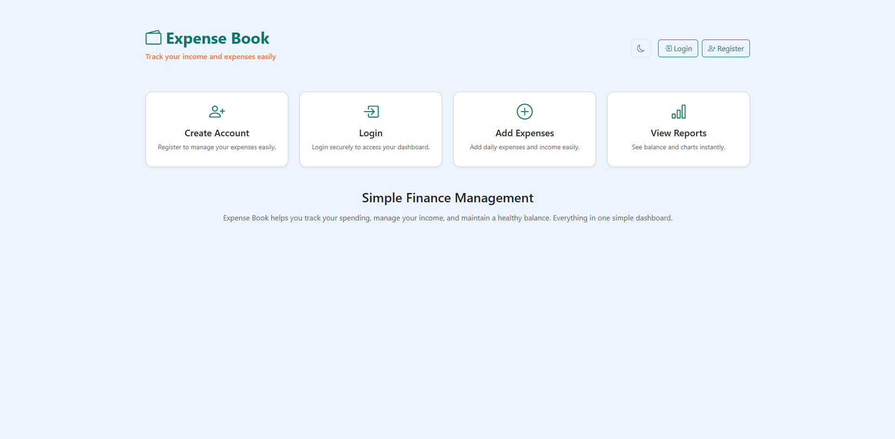

🌙dark mode

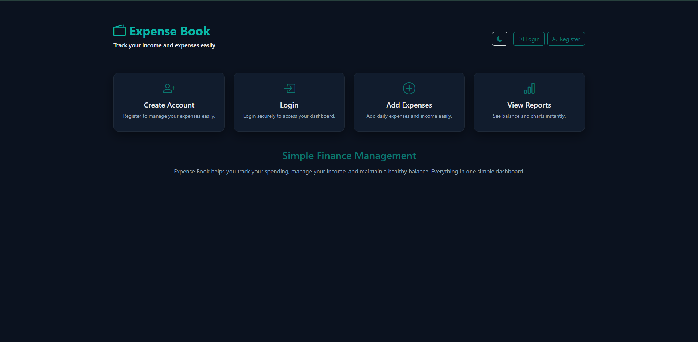

###🔐 Login Page

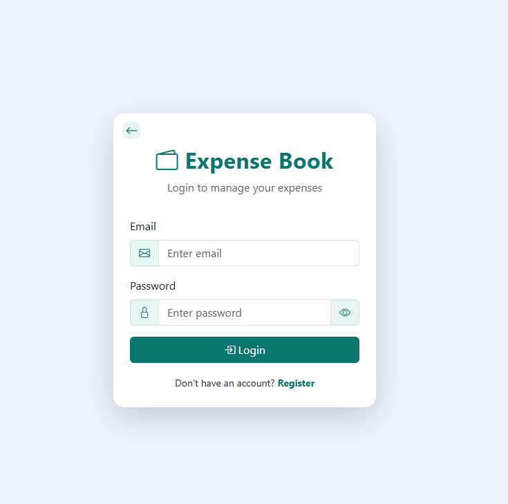

🌙dark mode

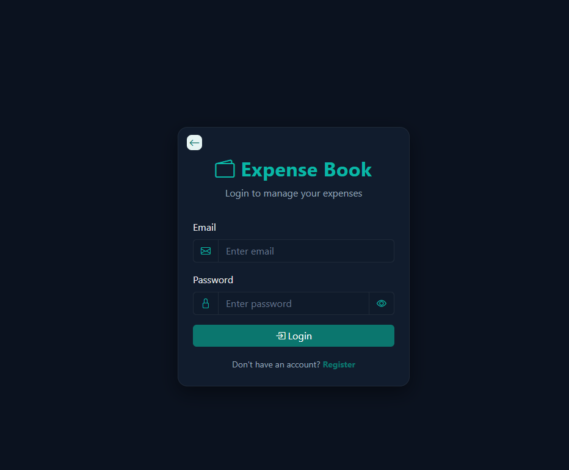

###📝 Register Page

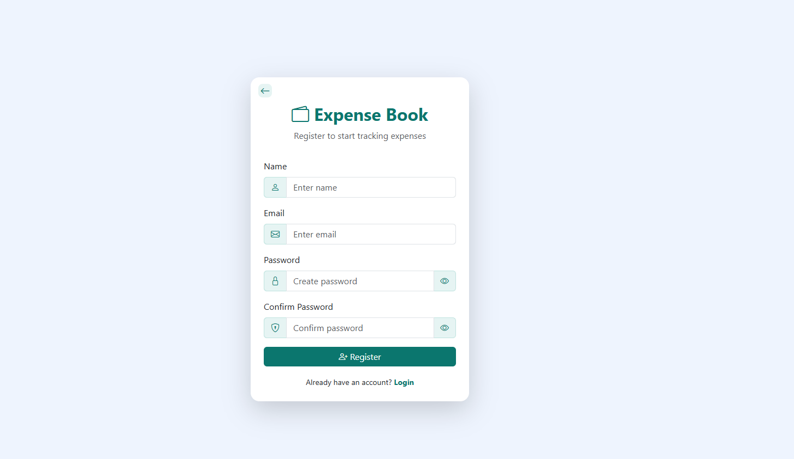

🌙dark mode

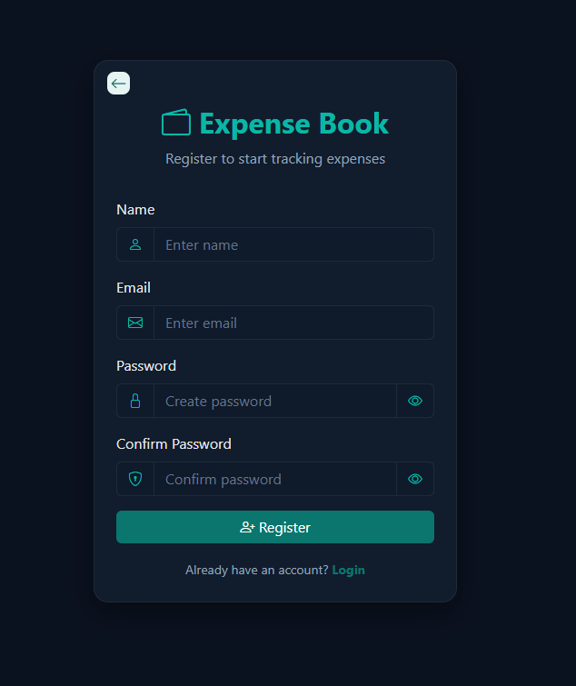

###📊 Dashboard

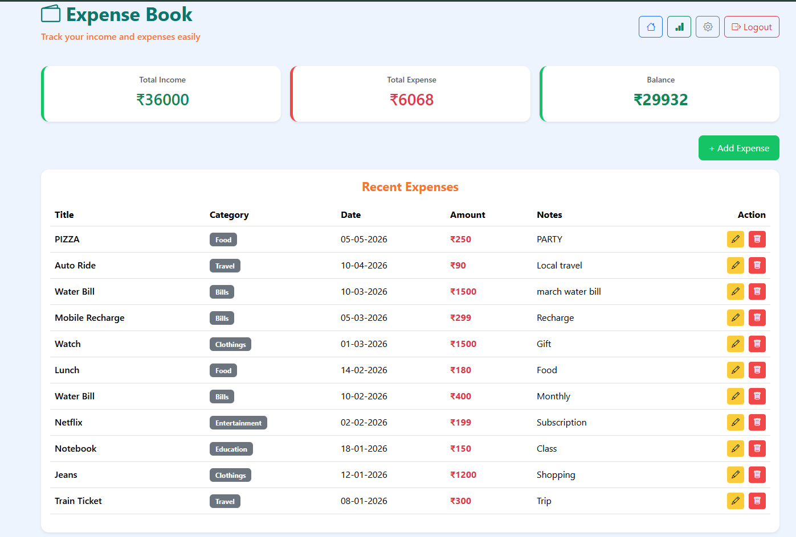

🌙dark mode

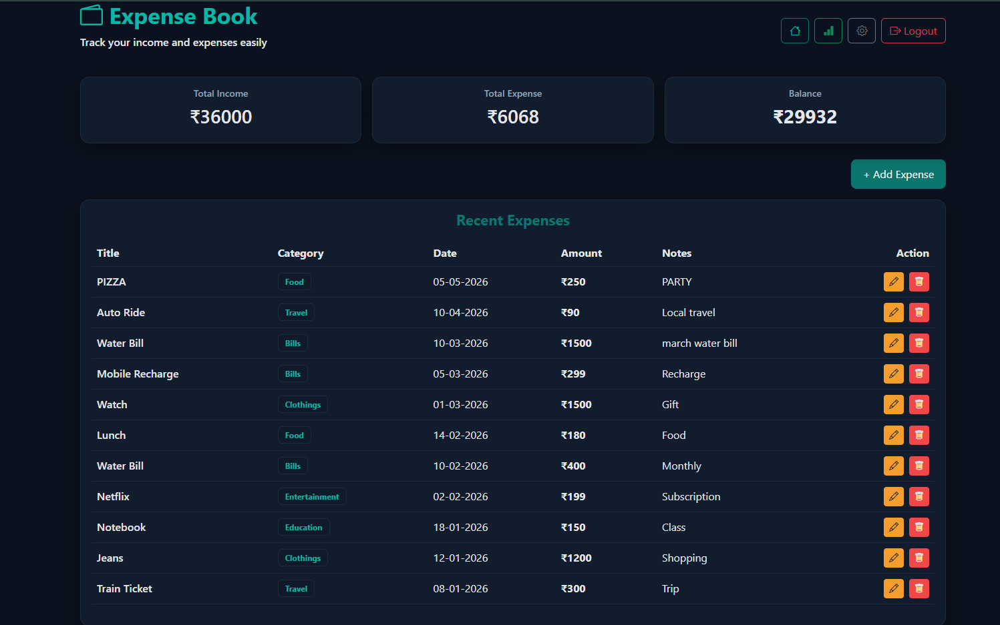

###💰 Manage Income

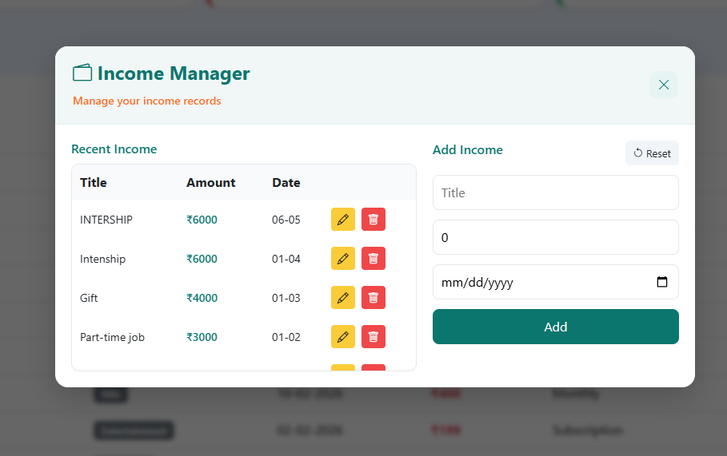

🌙dark mode

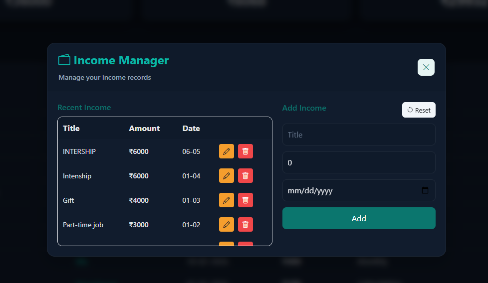

###➕ Add Expense

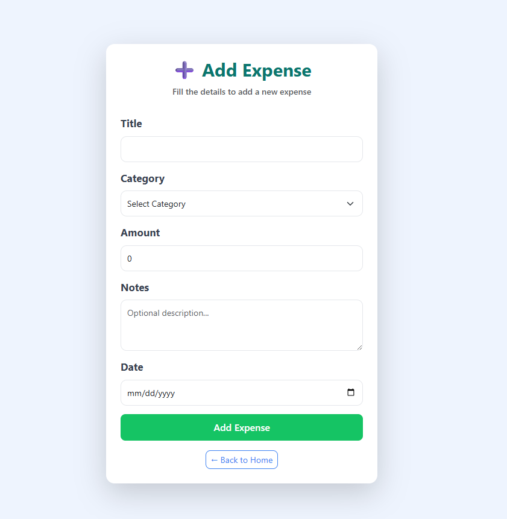

🌙dark mode

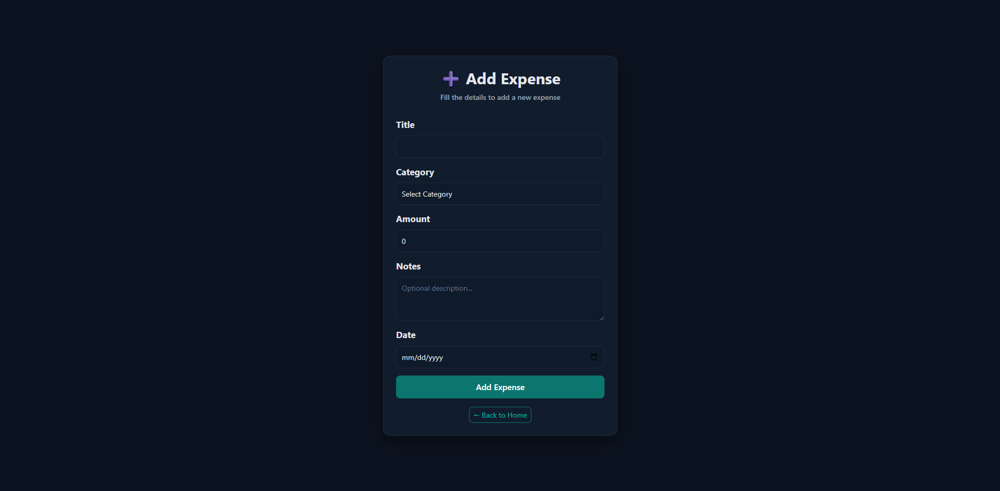

###✏️ Edit Expense

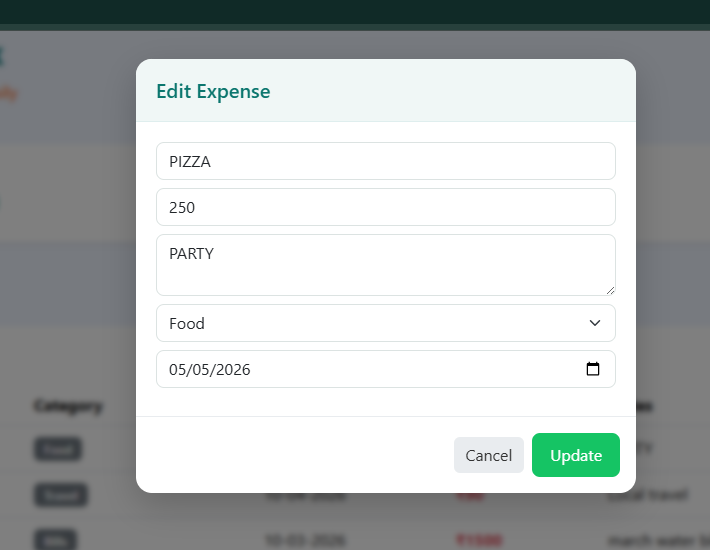

🌙dark mode

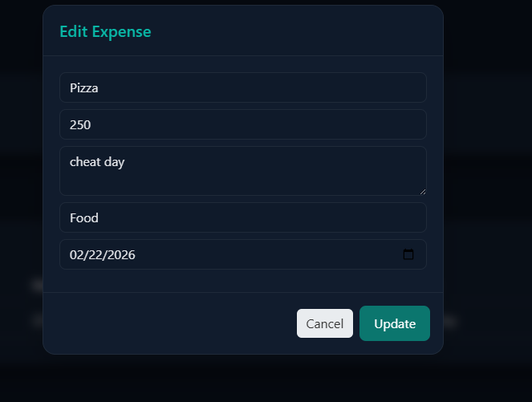

###📈 Monthly Chart

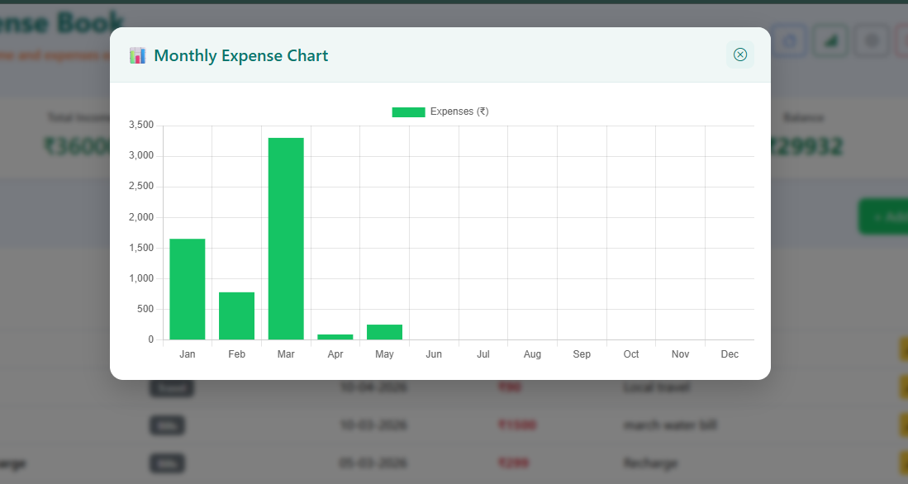

🌙dark mode

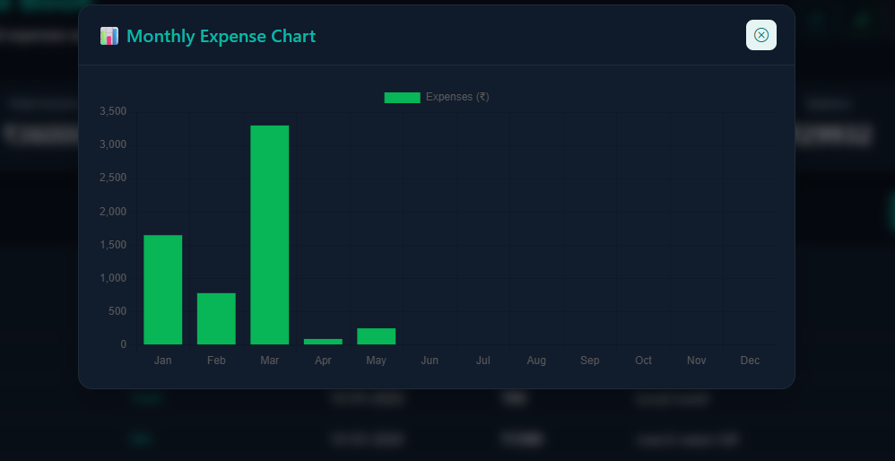

###⚙️ Settings Page

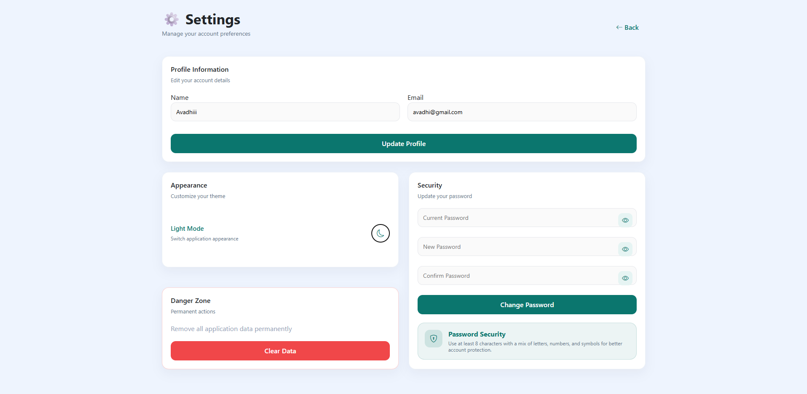

🌙dark mode

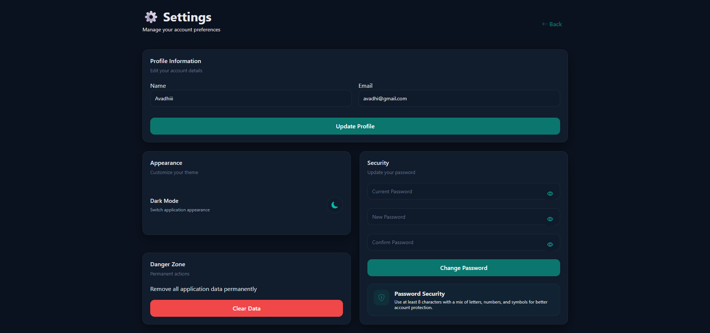

🚀 Key Highlights
Full-stack CRUD application (.NET + Angular)
Real-world expense tracking system
Clean and responsive UI
Dark/Light theme support
Data visualization with charts
Secure authentication system
